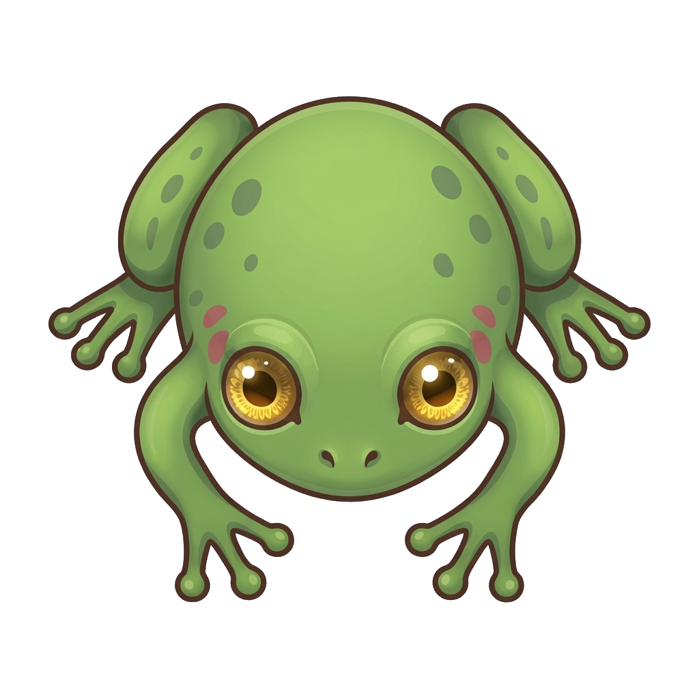
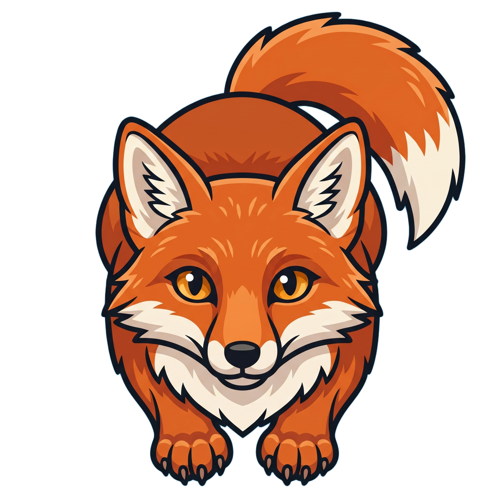
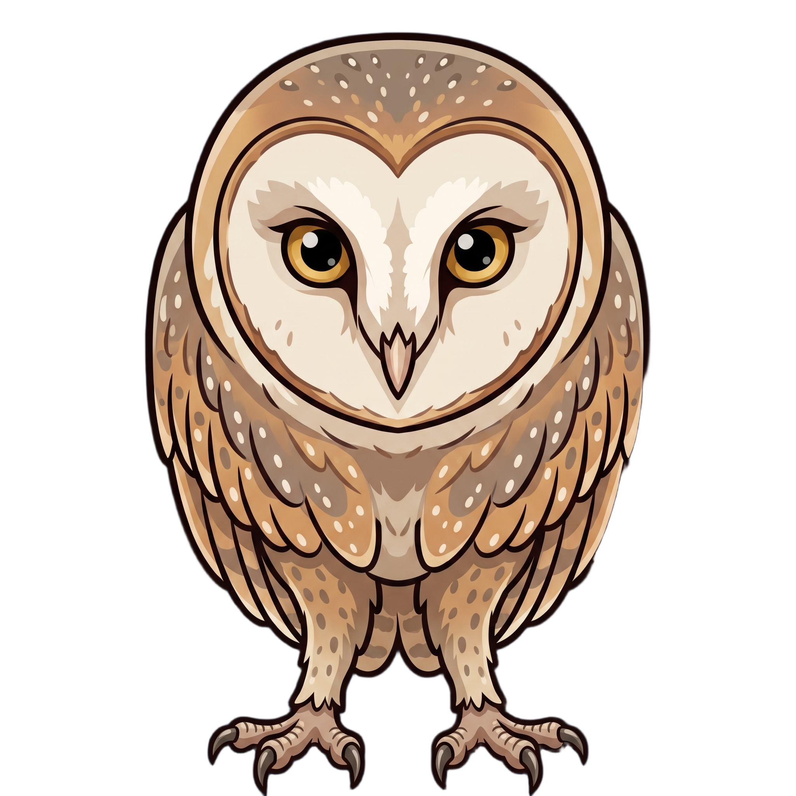

# Creature Climber

Portrait mobile climb game in Unity 6 (URP 2D). Tap left or right to hop up
alternating platforms. One climb loop drives several rule sets, a creature
shop, and local save.

<p align="center">
  
  
  
  
  
</p>

## What it does

| Mode | Idea |
| --- | --- |
| **Classic** | Mixed solid and breakable pads |
| **Blackout** | Classic climb with brief screen blackouts |
| **Race** | First to a finish height vs an AI climber |
| **Combatant** | Dodge flying hazards between pads |
| **Time Trial** | Score as high as you can before the clock hits zero |
| **Tempo** | Camera auto-scrolls — stay above the rising waterline |

Each mode has **Easy** (mixed pads) and **Hard** (every pad breaks). Time Trial
also has 90 / 120 / 200 second clocks.

Also in the build:

- 20 playable creatures with per-creature jump, fall, and score stats
- Themed platform skins and backgrounds (ScriptableObject databases)
- Shop unlocks paid with in-run coins
- Settings for audio, haptics, and display
- Buffered local save (`PlayerPrefs`) flushed on app pause

## Controls

| Input | Action |
| --- | --- |
| Tap / click left half of the screen, **A**, or **←** | Jump left |
| Tap / click right half of the screen, **D**, or **→** | Jump right |
| **Esc** | Pause |

Gamepad d-pad and shoulders work the same way.

## Stack

| Layer | Tech |
| --- | --- |
| Engine | Unity **6000.0.38f1** (Unity 6), URP 2D |
| Language | C# — runtime and editor assemblies |
| Input | Unity Input System (touch, mouse, keyboard, gamepad) |
| Data | ScriptableObject databases under `Assets/Data/Resources` |
| Save | Local `PlayerPrefs`, flushed on OS pause |
| Target | Portrait 1080×2400, Android-oriented player settings |

## Layout

```
Assets/
  Art/Sprites/          Creatures, platforms, backgrounds, combatants, UI
  Data/Resources/       ScriptableObject databases (loaded at runtime)
  Input/                Input System actions
  Scenes/               Play scene
  Scripts/
    Runtime/            Game code (CreatureClimb.Runtime)
      Bootstrap/        Scene wiring
      Core/             GameManager, modes, difficulty, rules
      Data/             Creature / platform / background / combatant / shop types
      Gameplay/         Climb, player, race, tempo, combatants, camera
      Services/         Save, audio, haptics, feedback
      UI/               Menus + HUD
      Device/           App lifecycle, platform helpers
    Editor/             Inspectors, database setup, scene build (CreatureClimb.Editor)
  Settings/             URP / volume profiles
Packages/               Unity package manifest
ProjectSettings/        Player, physics, editor (Force Text + Visible Meta Files)
Tools/                  Sprite edge-clean PowerShell helper
```

Runtime and editor code live in separate assemblies so play-mode code does not
depend on `UnityEditor`. Mode numbers and pad-break timings live in
`GameModeRules` rather than being copied across spawners and UI.

## Run locally

1. Install [Unity Hub](https://unity.com/download) and editor **6000.0.38f1**.
2. Open this folder as a Unity project.
3. Load `Assets/Scenes/SampleScene.unity`.
4. If the scene is empty, use the editor menu **Creature Climb → Build Game Scene**.
5. Press Play.

`Library/`, `Temp/`, `Logs/`, and generated `.csproj` / `.sln` files are
gitignored. Unity recreates them on open.

### Editor menus

| Menu | What it does |
| --- | --- |
| **Creature Climb → Build Game Scene** | Rebuilds a wired playable scene |
| Database setup items | Create/refresh ScriptableObject assets under `Assets/Data/Resources` |

## What to look at

If you are reviewing the code, start here:

| File | Why |
| --- | --- |
| `Assets/Scripts/Runtime/Core/GameManager.cs` | Run state, scoring, mode selection |
| `Assets/Scripts/Runtime/Core/GameModeRules.cs` | Per-mode / per-difficulty data |
| `Assets/Scripts/Runtime/Gameplay/Climb/LeafSpawner.cs` | Platform pool, side pattern, lookahead |
| `Assets/Scripts/Runtime/Gameplay/Player/PlayerController.cs` | Jump, miss, fall |
| `Assets/Scripts/Runtime/Services/SaveService.cs` | Loadout, high scores, unlocks |
| `Assets/Scripts/Runtime/Bootstrap/CreatureClimbSceneBuilder.cs` | Runtime scene construction |

## Git notes

- Unity YAML is stored as text (`Force Text` serialization, Visible Meta Files).
- Every asset has a `.meta` — keep them next to the file they belong to.
- Do not commit `Library/`, builds, or keystores.

## License and copyright

Copyright (c) 2026 iDesole. All rights reserved.

This repository is public so the project can be reviewed. It is **not** open
source. See [LICENSE](LICENSE).

Unity and Unity packages keep their own licenses. See [NOTICE](NOTICE).
